# Handover Plan: Smartphone-Only Vehicle & Speedometer Verification Agent
**Project:** Drifee by Briga (`Drive-e by Briga`)  
**Scope:** Verifikasi Fisik Kendaraan & Ekstraksi Telematika Speedometer EV Berbasis PWA & Model AI Efisien (Laya / Lightweight Vision)  
**Target Environment:** Next.js 14 PWA, Supabase PostgreSQL, Mobile Browser (Android Chrome / iOS Safari)  
**Status:** Ready for Implementation (Spesifikasi Siap Eksekusi)

---

## 1. Executive Summary & Context

Saat ini, armada komuter kendaraan listrik (EV) Drifee di koridor Cikarang dan Jabodetabek dioperasikan oleh mitra pengemudi dengan **100% menggunakan smartphone (HP) melalui aplikasi PWA**.

### Masalah Utama:
1. **Verifikasi Keberadaan Kendaraan:** Memastikan pengemudi benar-benar berada di unit mobil armada yang ditugaskan tanpa memasang modul telematika OBD-II/CAN-bus mahal di awal.
2. **Keterbatasan Perangkat Driver:** Tidak semua smartphone pengemudi memiliki sensor NFC (banyak menggunakan HP entry-level).
3. **Pencatatan Telematika Awal/Akhir:** Angka **Odometer (km)** dan **Status Baterai / SoC (%)** diperlukan untuk audit emisi Scope 3 POJK 51 dan perhitungan bagi hasil rental 85%:15%. Input manual rentan kesalahan (*human error*) dan manipulasi (*fraud*).

### Solusi yang Dirancang:
Membangun sistem verifikasi bertingkat (*Tiered Verification*):
1. **Tier 1 (Deteksi Keberadaan Kendaraan):** Hybrid Web NFC (1 detik tap di phone holder) dengan *fallback* Pindai Stiker QR Dashboard + Validasi Geofence Hub.
2. **Tier 2 (Ekstraksi Speedometer EV via Computer Vision):** Foto cluster speedometer MID diproses oleh model inferensi visual ultra-efisien berbasis arsitektur **Laya / Lightweight Decision Vision Model** dalam 1 kali jalan (*single forward-pass*, latensi ~35ms) untuk mengekstrak angka Odometer dan Persentase Baterai secara otomatis.

---

## 2. Arsitektur Alur Kerja (*System Architecture*)

```mermaid
flowchart TD
    Start["Driver Masuk Layar /go"] --> DetectNFC{"Apakah HP\nPunya NFC?"}
    
    DetectNFC -- Ya --> TapNFC["Driver Tap HP ke Phone Holder\n(Web NFC API - NDEFReader)"]
    DetectNFC -- Tidak --> ScanQR["Driver Pindai QR Stiker Dashboard\n(Kamera HTML5 Stream)"]
    
    TapNFC --> CheckGeo["Validasi Geofence Hub GPS\n(checkHubGeofence di Pool)"]
    ScanQR --> CheckGeo
    
    CheckGeo -- Gagal --> RejectGeo["Tolak Trip: Di luar Area Pool/Hub"]
    CheckGeo -- Sukses --> SnapCluster["Ambil Foto Layar Speedometer EV\n(<input capture='environment'>)"]
    
    SnapCluster --> ClientCompress["Kompresi Gambar di Browser Canvas\n(Resize 640x480, WebP ~40KB)"]
    ClientCompress --> ApiVision["POST /api/vision/parse-speedometer"]
    
    ApiVision --> LayaEngine["Laya Decision Vision / Microservice\nSingle Forward-Pass (~35ms)"]
    LayaEngine --> JsonTelemetry["Ekstraksi Data JSON:\n- odometer_km\n- battery_soc_percent\n- model_confirmed"]
    
    JsonTelemetry --> UIConfirm["Auto-Fill di Layar Driver:\nOdo & Baterai Terbaca Otomatis"]
    UIConfirm --> SaveEvidence["Simpan photo_evidence & Hash\nke Supabase Database"]
    SaveEvidence --> StartTrip["Trip Aktif & Siap Jalan!"]
```



---

## 3. Ground Truth Kode Eksisting (Referensi File Utama)

Agen pelaksana berikutnya wajib mengacu pada modul-modul berikut:

| File Eksisting | Peran & Kode yang Relevan |
|---|---|
| [`src/components/screens/LoginVehicleScreen.tsx`](file:///c:/Users/yabes/Documents/Drive-e%20by%20Briga/src/components/screens/LoginVehicleScreen.tsx) | Tempat alur pemilihan kendaraan, input `initialSoc`, `initialOdo`, dan eksekusi `checkHubGeofence()`. |
| [`src/app/api/trips/verify/route.ts`](file:///c:/Users/yabes/Documents/Drive-e%20by%20Briga/src/app/api/trips/verify/route.ts#L65-L73) | Schema backend sudah memiliki wadah `photo_evidence` (`start_odometer`, `start_battery`, `captured_at`, `gps_location`). |
| [`src/lib/geofence.ts`](file:///c:/Users/yabes/Documents/Drive-e%20by%20Briga/src/lib/geofence.ts) | Logika Haversine validasi radius Hub Cikarang Dry Port & Halim Perdanakusuma. |
| [`src/types/telematics.ts`](file:///c:/Users/yabes/Documents/Drive-e%20by%20Briga/src/types/telematics.ts) | Definisi tipe `EVVehicle`, `TripRecord`, dan telematika baterai. |

---

## 4. Rincian Pekerjaan Teknis (*Implementation Breakdown*)

### Sprint 1: Modul Deteksi Kendaraan Hybrid (Web NFC + QR Scanner)
* **File Target:** `src/hooks/useVehicleDetector.ts` & `src/components/vehicle/VehicleScannerModal.tsx`
* **Spesifikasi Teknis:**
  1. Cek ketersediaan `"NDEFReader" in window`. Jika ada, aktifkan listener NFC otomatis:
     ```typescript
     const ndef = new (window as any).NDEFReader();
     await ndef.scan();
     ndef.onreading = (event: any) => {
       const record = event.message.records[0];
       const vehicleCode = new TextDecoder().decode(record.data);
       onVehicleDetected(vehicleCode);
     };
     ```
  2. Jika NFC tidak tersedia atau gagal izin, tampilkan jendela kamera HTML5 dengan pemindai QR berbasis `BarcodeDetector` / library ringan (`html5-qrcode` / `@zxing/browser`).
  3. Memvalidasi kode unik kendaraan (misal: `EV-01` untuk Wuling Air EV, `EV-02` untuk Ioniq 5).

### Sprint 2: UI Pengambilan Foto Speedometer & Client Preprocessing
* **File Target:** `src/components/vehicle/SpeedometerCaptureModal.tsx`
* **Spesifikasi Teknis:**
  1. Komponen modal kamera dengan *guide overlay* berbentuk kotak siluet speedometer mobil listrik.
  2. Mengambil gambar menggunakan kamera resolusi tinggi dengan mode makro/environment:
     `<input type="file" accept="image/*" capture="environment" />` atau MediaDevices video stream.
  3. **Canvas Preprocessing:**
     - Resize gambar maksimal dimensi terpanjang $800\text{ px}$.
     - Konversi ke format `image/webp` dengan kualitas $0.8$ (ukuran berkas turun dari $4\text{ MB} \to \sim 40\text{ KB}$ untuk menghemat kuota internet pengemudi).
     - Menghasilkan string base64 untuk dikirim ke API.

### Sprint 3: Backend API Vision Parser (`/api/vision/parse-speedometer`)
* **File Baru:** `src/app/api/vision/parse-speedometer/route.ts`
* **Spesifikasi Request:**
  ```typescript
  interface ParseSpeedometerRequest {
    image_base64: string;
    vehicle_code: string; // misal 'EV-01'
    gps_lat: number;
    gps_lng: number;
    timestamp: number;
  }
  ```
* **Spesifikasi Response:**
  ```typescript
  interface ParseSpeedometerResponse {
    success: boolean;
    odometer_km: number | null;
    battery_soc_percent: number | null;
    vehicle_model_matched: string | null;
    confidence: number;
    fallback_required: boolean;
    evidence_url?: string;
  }
  ```
* **Integrasi Model AI:**
  1. **Primary Worker:** Meneruskan gambar terkompresi ke microservice inferensi model Laya (atau lightweight VLM endpoint) via HTTP POST berlatensi rendah ($<100\text{ ms}$).
  2. **Prompt / Schema Ekstraksi Khusus EV Cluster:**
     - Mengenali pola persen baterai (misal: `88%`, bar hijau, angka dekat ikon baterai).
     - Mengenali total Odometer kumulatif (misal: `14250 km` atau `ODO 014250`).
     - Mengabaikan Trip A / Trip B / Kecepatan sesaat ($0\text{ km/h}$).
  3. **Resilience Fallback:** Jika microservice lokal/Laya sedang *cold-start* atau tidak dapat dijangkau, backend otomatis melakukan fallback ke Google Gemini Flash Vision API (atau Cloudflare Workers AI) agar operasional driver tidak terhambat.

### Sprint 4: Integrasi Form & Penyimpanan Bukti Audit
* **File Target:** `src/components/screens/LoginVehicleScreen.tsx`
* **Spesifikasi Alur:**
  1. Nilai yang diekstrak AI otomatis mengisi input `initialSoc` dan `initialOdo`.
  2. Tampilkan badge konfirmasi hijau: *"✓ Terdeteksi Otomatis: ODO 14.250 km, Baterai 88%"*.
  3. Berikan opsi manual klik angka jika driver perlu melakukan koreksi kecil (*human-in-the-loop*).
  4. URL foto bukti disimpan ke Supabase Storage bucket `trip-evidence` dan dicatat ke kolom `photo_evidence` pada tabel `trips`.

### Sprint 5: Testing & Quality Assurance
* **File Baru:** `tests/e2e/tier1-features/vehicle-verification-vision.test.ts`
* **Cakupan Pengujian:**
  1. Test parser API membaca format gambar cluster Wuling Air EV dan Hyundai Ioniq 5.
  2. Test penanganan gambar gelap/buram (*fallback_required = true*).
  3. Test sanitasi data Odometer tidak boleh lebih kecil dari Odometer trip terakhir kendaraan.
  4. Test verifikasi boundary baterai ($0 \le \text{SoC} \le 100$).

---

## 5. Security & Anti-Fraud Mitigation

1. **Anti Fake GPS / Remote Photo:**
   - Foto harus diambil langsung dari kamera (`capture="environment"`), bukan unggah dari galeri foto.
   - Pengecekan metadata waktu (*client timestamp vs server timestamp* tidak boleh berselisih $> 120\text{ detik}$).
   - Pengecekan GPS saat foto diambil harus berada di dalam radius Geofence Hub Pool Cikarang.
2. **Sanity Check Fisika Odometer:**
   - Backend membandingkan `odometer_km` yang terbaca dengan catatan terakhir di database `vehicles.last_odometer_km`.
   - Jika odometer terbaca lebih rendah daripada rekor kemarin, sistem menolak trip dan mengirim notifikasi anomali ke admin dashboard.

---

## 6. Panduan untuk Agent Pelaksana (*Instructions for Next Agent*)

Untuk memulai eksekusi handover ini, jalankan tahapan berikut secara berurutan:

1. **Konteks Proyek:**
   Bekerjalah di repositori `c:\Users\yabes\Documents\Drive-e by Briga`. Pastikan branch dalam keadaan bersih (`git status`).
2. **Langkah 1:**
   Buat endpoint backend `src/app/api/vision/parse-speedometer/route.ts` beserta unit test mock-nya.
3. **Langkah 2:**
   Bangun modal pemindai `SpeedometerCaptureModal.tsx` dengan fitur kompresi canvas.
4. **Langkah 3:**
   Pasang pendeteksi Web NFC dan QR scanner di `LoginVehicleScreen.tsx`.
5. **Verifikasi:**
   Jalankan `npm test` dan `npm run build` untuk memastikan tidak ada *type error* atau regresi pada 164 tes yang sudah ada.
